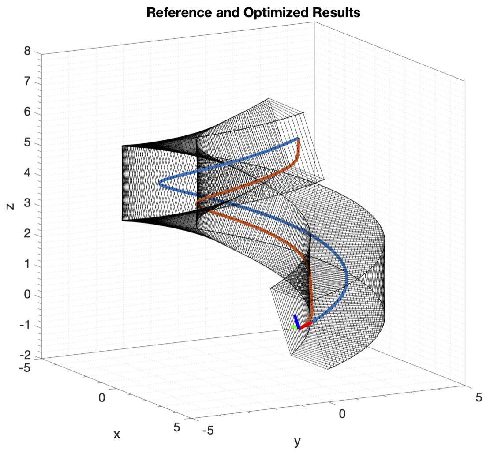
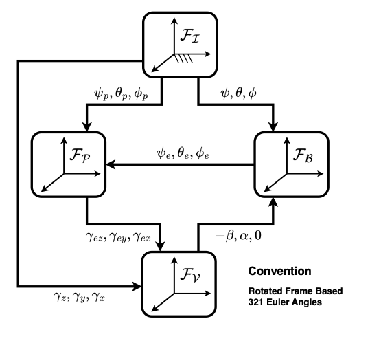
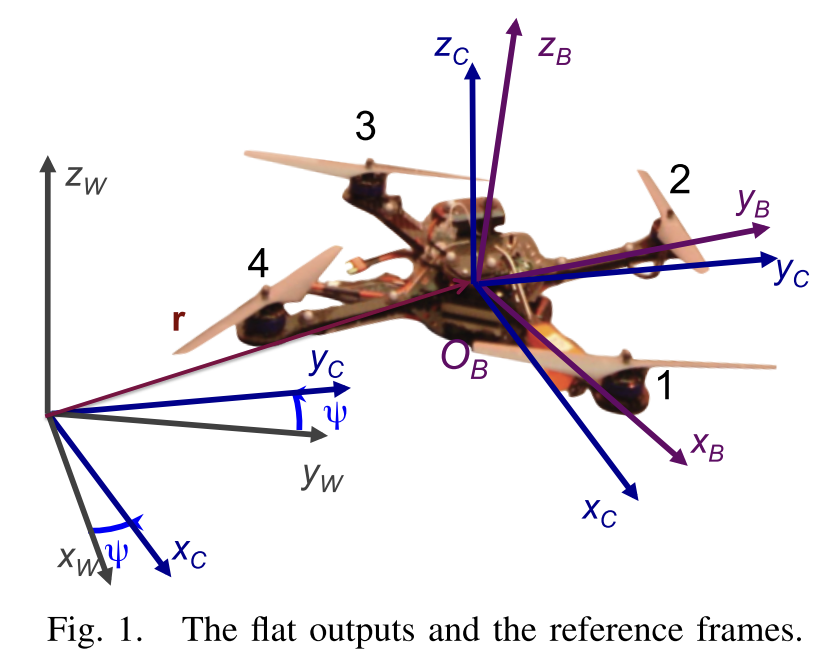
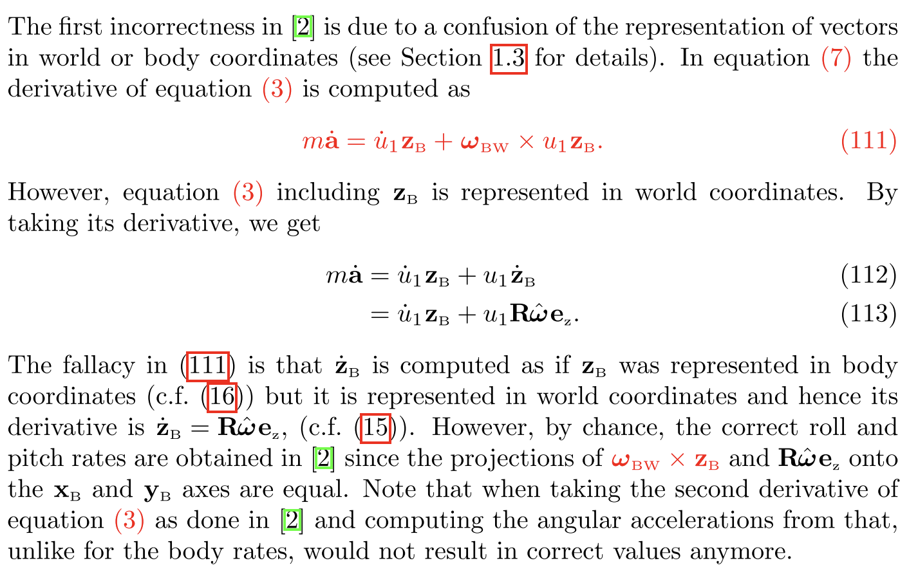

# Thesis
## Subject and The Simplified Summary
My thesis subject is mainly about generating time optimal trajectories for quad-copters in tubular spaces, which is mainly used in [drone racing](https://youtu.be/fBiataDpGIo?si=WJqBSIkRrKpmBaSQ&t=91). 

Aim is the find the trajectory in the tube that has the minimum time which also must be feasible. In the image above a tube with a square cross section is created whose centerline is the blue curve. Optimized trajectory is the orange one clearly pushing the boundaries of the tube.

I have utilized a method from autonomous ground vehicle racing and lifted it into 3D (several others did the same as well but I use different frames). A simplified summary of the equations are below along with the image of used frames.

First main point is to use of The Frenet Frame to track deviations from the center line. Aim is not to follow the center line perfectly but find the minimum time curve within the known tube bounds. Thus, position states are not $[x, y, z]^T$ but $[s,e_n,e_b]^T$

$\dot s = \frac{Vcos(e_{\theta})cos(e_{\psi})}{1 - e_n \kappa}$

$\dot e_n = Vcos(e_{\theta})sin(e_{\psi}) + \dot s \tau e_b$

$\dot e_b = -Vsin(e_{\theta}) - \dot s \tau e_n$

The second important part is the spatial formulation independent of time. With the help of the chain rule, dynamics are converted from $[\dot s, \dot e_n, \dot e_b]^T$ to $[t',e_n',e_b']^T$ where $k' = dk/ds$

$t' = \frac{1 - e_n \kappa}{Vcos(e_{\theta})cos(e_{\psi})}$

Then several other dynamics like attitude are injected. Since the track distance is constant, a fixed horizon optimization problem is formed minimizing the time, which now is a state. Detailed derivation can be shared separately since it is long.

## Problem - Differential Flatness and Comparison of Two Papers
As the method is based on the numerical optimization, it needs a good enough initial guess for several reasons. 
1. Problem is highly non-convex and initial guess changes the optimal solution found due to the local minima. 
2. Without a proper initial guess the whole optimization might fail it is in a restricted space. 
3. It will considerably shorten the solution time

I've decided to feed basic centerline being followed by the drone with minimal speed as the initial guess. Although it is probably not optimal, it will improve the convergence behavior and shorten the solution time. To generate the states and required inputs for that motion, I've planned to use the **differential flatness property** of the quad-copters.

There are two papers from reputable sources which I had planned to refer.

[1] [M. Faessler and A. Franchi and D. Scaramuzza, “Differential Flatness of Quadrotor Dynamics Subject to Rotor Drag for Accurate ,High -Speed Trajectory Tracking,”](https://arxiv.org/pdf/1712.02402)

[2] [D. Mellinger and V. Kumar, “Minimum snap trajectory generation and control for quadrotors”](https://ieeexplore.ieee.org/document/5980409)

[2] is the original paper showing the differential flatness property of the quad-copters and [1] is a paper adding rotor drag. However, at the end of the [1], authors (who are very famous in the Drone Racing Research) state that the derivation of the [2] was wrong at two points. 

Regarding the first error, I believe the point of confusion is that they have not used a clear notation and actually they have found the same equations. Here I will try to explain my approach with ME502 notation.

### Common Part
Differential flatness property is based on the expression of inputs as derivatives of the known/required output states. Both papers have used $y_{required} = [x(t), y(t), z(t), \psi(t)]^T$

As acceleration is caused by gravity and thrust (which is in body z-axis), the following expression is written:

$m\ddot{\vec r} = -mg\hat z_W + T\hat z_B$

Thrust vector can be isolated:

$\vec T = m(\ddot{\vec r} + g\hat z_W)$

From this equation it is possible to find the following two:
1. Full description of $\hat z_B$ as a unit vector. (i.e. fixing the direction of the thrust)
2. Magnitude of the thrust

The disagreement arises when the rate of change of the $\hat z_B$ is to be calculated.

### I - Original Paper's Derivation
In author's notation, the equation is as follows:

$m\ddot{\mathbf{r}} = −mg\mathbf{z}_W + T\mathbf{z}_B$

For rate derivation they take the derivative and write the following expression:

$m\dddot{\mathbf{r}} = \dot T \mathbf{z}_B + \omega_{BW} \times T\mathbf{z}_B$ [eq1]

### II - Original Paper's Derivation In Clearer Notation
If the equation is not resolved in any frame, that seems correct to me. I would've written that as follows

$D_w(m\ddot{\vec r}) = D_w(-mg\vec z_W + T\vec z_B)$

Gravity has no time derivative wrt. The Earth. Also defining $\dddot{\vec r} = D_w(\ddot{\vec r})$

$m\dddot{\vec r} = D_w(T\vec z_B)$

Coriolis Transport Theorem

$m\dddot{\vec r} = D_b(T\vec z_B) + \vec \omega_{B/W} \times T\vec z_B$

Then dealing with the Body Frame Differentiation and product rule

$m\dddot{\vec r} = \dot T \vec z_B + TD_b(\vec z_B) + \vec \omega_{B/W} \times T\vec z_B$

As $D_b(\vec z_B) = 0$ by definition

$m\dddot{\vec r} = \dot T \vec z_B + \vec \omega_{B/W} \times T\vec z_B$

which is equal to the [eq1]. And still equations are not resolved in any frame.

### III - Second Paper Fixing The Mistake
I'll just add the image of the paragraph

### IV - Confusing Part of [1]
I think the authors of the original paper [2] did not represented vectors is the World Coordinates as the [1] suggests. 

Resolving the "wrong" equation in the World Frame in a cleaner notation

$m\dddot{\vec r} = \dot T \vec z_B + \vec \omega_{B/W} \times T\vec z_B$

results in

$m\dddot{\bar r}^{(W)} = \hat C^{(W,B)}( \dot T \bar z_B^{(B)} + T\tilde \omega_{B/W}^{(B)} \bar z_B^{(B)})$

In the [1], they say vectors are represented in the World Frame where as angular velocities are in the Body Frame.

$m\dddot{\bar r}^{(W)} =  \dot T \bar z_B^{(W)} + T \hat C^{(W,B)}\tilde \omega_{B/W}^{(B)} \bar z_B^{(B)}$

Also they define

$\mathbf e_z = [0, 0, 1]^T$

$m\dddot{\bar r}^{(W)} =  \dot T \bar z_B^{(W)} + T \hat C^{(W,B)}\tilde \omega_{B/W}^{(B)} \bar e_z$

which seems inline with the both of the papers.

